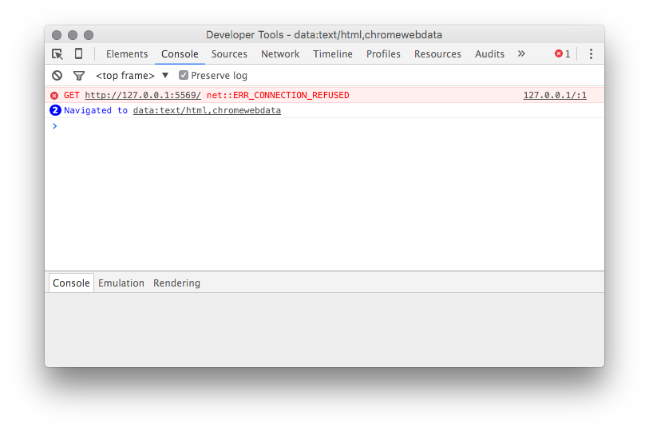

# Introduction

Debugging Shiny applications can be a difficult task for a variety of reasons. Among them:

1. R's debugger lacks some features provided by other modern debuggers.
2. It can be more difficult to visualize the order of execution in a reactive system.  
3. There's a lot of Shiny overhead on the stack when execution halts in a Shiny app.

The goal of this article is to arm you with techniques for debugging in Shiny specifically. If you're interested in debugging R more generally, we recommend reading [Debugging with RStudio](https://support.rstudio.com/hc/en-us/articles/205612627-Debugging-with-RStudio) instead.

# Debugging

## Breakpoints

If you know, or suspect you know, where in the code the problem lies, the most straightforward debugging technique is setting a breakpoint. In RStudio, you can do this just by clicking to the left of the line number. 

When you run your Shiny app, R will stop execution at the breakpoint, and you can begin stepping through your code.

While stepping, you can examine the contents of the environment and the callstack to see how execution reached your code, and what values it's working with.

### Breakpoint Limitations

Unfortunately, breakpoints aren't helpful in all situations. For technical reasons[^1], breakpoints can *only* be used inside the `shinyServer` function. You can't use them in code in other .R files. 

Breakpoints can tell you something about why code is executing, but they can't always tell you why something *isn't* executing. 

## browser() statements

The `browser()` statement is another useful debugging tool. It acts like a breakpoint--when evaluated, it halts execution and enters the debugger. You can add it anywhere an R expression is valid. 

Unlike breakpoints, `browser()` works everywhere, so it's suitable for use in any code invoked by your Shiny app. You can also invoke `browser()` conditionally to create conditional breakpoints; for instance:

    if (x > 1024)
      browser()

The downside of `browser()` is that you need to re-run your Shiny application to apply it, and you need to remember to take it out afterwards. 

# Tracing 

In many cases it's difficult to diagnose a problem by halting execution, and instead you need to observe the system as it runs. This is particularly true of Shiny applications since the system doesn't run once through linearly as an R script does! We'll look at a number of ways to peek into the system while it's running.

## Showcase Mode

If you've ever visited the [Shiny Gallery](http://shiny.rstudio.com/gallery/), you've probably seen Showcase Mode. In Showcase Mode, your code is shown alongside your application, and your application's server code flashes yellow when it executes. Here, for example, you can see the plot output chunk re-executing when the inputs change.

Showcase Mode is not enabled by default for privacy reasons (most people don't want it to be easy for others to see their app's code), but it's easy to turn on. Just invoke runApp directly with `display.mode="showcase"`:

    > shiny::runApp(display.mode="showcase")

If you want showcase mode to be on by default (for an extended debugging session, or if you want to use showcase mode in conjunction with the IDE Run App button), add a file named `DESCRIPTION` to your app's folder, with these contents:

    Title: My App
    Author: Alice Smith
    DisplayMode: Showcase
    Type: Shiny
    
## The Reactive Log

Another way to trace the execution of reactives at runtime is to use the Shiny reactive log. In addition to telling you which reactives are executing, the reactive log will help you visualize the dependencies between reactive objects, and give you very detailed information about what's happening under the hood as Shiny evaluates your application.

Start a new R session and run the command:

    > options(shiny.reactlog=TRUE); 
  
Then, launch your Shiny app. In the Shiny app, press *Ctrl+F3* to launch the reactive log visualization. It'll look something like this:

The reactive log has many features and controls and we won't belabor them here; for more information, type `?shiny::showReactLog` at the R console, or read the [`showReactLog` online documentation](http://shiny.rstudio.com/reference/shiny/latest/showReactLog.html).

## "printf" tracing

In some situations the best tracing technique is the oldest: a statement that emits text to the console when it's reached. These are more work to use, but offer the unique advantage of allowing you to emit the values of variables without interrupting execution. 

You can do this by using the `cat` command in your Shiny application. For instance, from the sample Shiny application:

    # generate bins based on input$bins from ui.R
    x    <- faithful[, 2] 
    bins <- seq(min(x), max(x), length.out = input$bins + 1)
    cat("drawing histogram with", input$bins, "bins\n")
    
After adding your `cat` statement, run your Shiny application and watch the R console. You'll see a line emitted each time the code runs. 

    Listening on http://127.0.0.1:5757
    drawing histogram with 30 bins
    drawing histogram with 35 bins

### Tracing in Deployed Applications

`cat()` is also one of the few tracing techniques which works well even on a remote system. If your application is deployed on RStudio's [ShinyApps.io service](https://www.shinyapps.io/), then you can see the output the `cat()` traces in your deployed app, in real time. Here's how:

1. Add `cat()` tracing statements to your application.
2. Deploy your application, using the RStudio IDE or the `rsconnect::deployApp()` function. 
3. From the application's directory, run `rsconnect::showLogs(streaming = TRUE)`
4. Navigate to the application (on ShinyApps.io) in your browser, and watch the R console for output.

You'll see something like the  following:

    2016-01-29T01:26:12.291216+00:00 shinyapps[77594]: 
    2016-01-29T01:26:12.291218+00:00 shinyapps[77594]: Starting R with process ID: '26'
    2016-01-29T01:26:14.162374+00:00 shinyapps[77594]: drawing histogram with 30 bins
    2016-01-29T01:26:14.495249+00:00 shinyapps[77594]: drawing histogram with 35 bins

If your application gets a lot of usage, you may wish to guard the `cat()` output so that only your own sessions emit it, as it will be otherwise difficult to distinguish output from your own sessions with output from other sessions. 

TODO: describe how to emit session ID?

### cat() Caveats

One thing to keep in mind while using `cat()` to trace values at runtime is that Shiny doesn't give it special treatment--if your `cat()` expression references reactive values, a dependency will be created. This may cause your application to behave differently with the `cat()` statement than without it, which is obviously undesirable.

Make certain that any reactives referenced by the `cat()` statement are already referenced elsewhere in the observer or reactive in which it resides. 

## Client/Server Tracing

Shiny's architecture consists of a client (the browser) and a server (an R process). The two are connected by a [websocket](https://developer.mozilla.org/en-US/docs/Web/API/WebSockets_API) that receives state changes from the client, such as new values for input controls, and distributes state changes from the server, such as new output values. 

In some cases (for instance, if you're writing your own custom bindings) it's helpful to see exactly what's going across the wire. You can watch the JSON emitted to and received from the websocket by turning on tracing:

    > options(shiny.trace = TRUE)

Once tracing is on, you'll se a lot of output in the console while your app is running. Here's a sample:

    SEND {"config":{"workerId":"","sessionId":"04531d50d12554bd981b24b9d3983cc4"}}
    RECV {"method":"init","data":{"bins":30,".clientdata_output_distPlot_width":610,".clientdata_output_distPlot_height":400,".clientdata_output_distPlot_hidden":false,".clientdata_pixelratio":1,".clientdata_url_protocol":"http:",".clientdata_url_hostname":"127.0.0.1",".clientdata_url_port":"5569",".clientdata_url_pathname":"/",".clientdata_url_search":"",".clientdata_url_hash_initial":"",".clientdata_singletons":"",".clientdata_allowDataUriScheme":true}}

The log is from the perspective of the client, so:

`SEND` indicates data sent from the browser to the R session.

`RECV` indicates data sent from the R session to the browser.

# Errors

Some code defects will result in a runtime error. While no one likes to see errors, they can be an invaluable tool for helping you verify code preconditions at runtime. Often, throwing an error immediately when the system's state becomes invalid (known as the [fail-fast property](https://en.wikipedia.org/wiki/Fail-fast)) will save you debugging time, as an observed problem may be miles downstream from its source. 

Whether you're throwing your own errors or handling errors thrown elsewhere (for instance, by packages your Shiny application uses), here are some essentials for your toolkit.

## R errors

## JavaScript errors

Most web browsers contain a JavaScript console that can be used to view logs and unhandled exceptions. We'll focus here on Chrome since it's widely used on all three major desktop platforms, but the other major browsers are structured very similarly. 

To reach the JavaScript console in Chrome, do one of the following:

1. Click on the "hamburger menu" in the upper right corner of the browser
2. Navigate to *More Tools -> Developer Tools.*

Or, right click on the Shiny app and choose Inspect.

Once you have the developer tools open, click the Console tab. Here you'll see any unhandled JavaScript exceptions; for instance, here's an error raised when trying to load a Shiny app that's no longer running:

### First-chance exceptions

The JavaScript console doesn't tell you about *all* the JavaScript exceptions that were thrown, only those that were never caught. Sometimes, however, an exception that's swallowed by an exception handler contains crucial information. 

A little-known feature in most JavaScript debuggers will allow you to see exceptions when they're *thrown* (regardless of whether they're caught later). These are sometimes called "first chance" exceptions. You can break on them in Chrome by clicking the stop button labeled with pause (representing break on exception) and then checking the box "Pause on Caught Exceptions".

If the thrown/caught terminology is confusing to you, remember that the debugger typically pauses on *uncaught* (or unhandled) exceptions; you're asking it to pause on *caught* (handled) exceptions too.

There are great reference materials online available for most browser debugging tools (here's [one for Chrome](https://developer.chrome.com/devtools/docs/javascript-debugging)).

### RStudio Desktop 

On Windows and Linux, there's a JavaScript console and debugger built into RStudio (many components of RStudio, including the window that displays Shiny applications, is built on an embedded copy of [QtWebKit](https://doc.qt.io/qt-5/qtwebkit-index.html]). You can't access it through a menu, but you can by right-clicking on your Shiny application and choosing *Inspect*.
 
On OS X, RStudio uses your system's version of Safari to show Shiny applications. By default, Safari's JavaScript debugging tools are turned off inside RStudio, but you can turn them on using this command in Terminal: 

    defaults write org.rstudio.RStudio WebKitDeveloperExtras -bool true
    
Restart RStudio, start your Shiny app, right-click on it, and you'll see a new *Inspect Element* option. Click it to launch the Safari JavaScript debugger.

 
# Asking for Help

TODO: describe what to send to shiny-discuss

[^1]: Breakpoints work by modifying a function body at runtime to include a `browser()` statement. The functions in Shiny applications are ephemeral--they are created on demand when the app starts, and exist only why it's running. 
