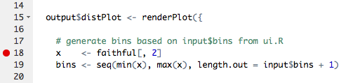

# Overview

## Outline

We'll cover three main areas:

- Debugging
- Tracing 
- Errors

# Debugging

"Finding your bug is a process of confirming the many things that you believe are true — until you find one which is not true."

-- Norm Matloff 

Author of *The Art of R Programming* and *The Art of Debugging*

## Breakpoints



*Breakpoint (armed)*

## Breakpoints


*Stepping after execution*

## Breakpoints {.build}

### Pros

- Doesn't change code
- Can inspect local values/stack
- Can step through following code

### Cons

- Only works inside `shinyServer`
- Can't tell you why something isn't happening
- Interrupts program flow; not conditional

## browser()


## browser() {.build}

### Pros

- Similar advantages to breakpoints
- Valid anywhere an R expression is valid
- Can be made conditional

### Cons
 
- Changes your code!
- Interrupts program flow
- Can't tell you why something isn't happening

# Tracing

## Showcase Mode


```{r eval=FALSE}
runApp(..., display.mode="showcase")
```

## Reactive Log


```{r eval=FALSE}
options(shiny.reactlog=TRUE)
runApp(...)
showReactLog()
```

# Error Handling


