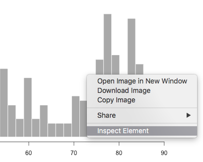

## About me


<div class="notes">
Here's me about 35 years ago, at the Stanford Medical Center, just a few blocks away.
</div>

## About me

- Software engineer since mid-90's
- RStudio IDE developer since 2013
- Worked on RStudio debugging features

<div class="notes">
Web developer, worked at Microsoft on Office.
</div>

## Goals

### You will learn:

<div class="columns-2">
- Tools for finding bugs & diagnosing errors in Shiny applications
- Little-known ways to look under the hood 
- How to debug problems in deployed apps
- Cheat code for OSX IDE JavaScript debug tools


</div>

<div class="notes">
This is a tools talk. If you're like me, when you debug an app you observe a problem and then you open up your bag of tools and pick one to use to attack the problem. Our goal here today is to fill your bag with lots of tools so you have the right one. We'll discuss how to use each tool and when you'd want to.

We'll cover simple and advanced tools. Whether you're new 
</div>

## Non-goals


## Outline

### We'll cover three main areas:

- Debugging
- Tracing 
- Errors

# Debugging

"Finding your bug is a process of confirming the many things that you believe are true — until you find one which is not true."

-- Norm Matloff 

Author of *The Art of R Programming* and *The Art of Debugging*

## Breakpoints


*Breakpoint (armed)*

## Breakpoints {.build}


*Stepping after execution*

## Breakpoints

### Pros

- Can inspect local values/stack
- Can step through following code
- Doesn't change code

### Cons

- Only works inside `shinyServer`
- Can't tell you why something isn't happening
- Interrupts program flow; not conditional

## browser()


## Conditional breakpoint

```{r eval=FALSE}
if (input$bins > 50)
  browser()
```

## browser() 

### Pros

- Similar advantages to breakpoints
- Valid anywhere an R expression is valid
- Can be made conditional

### Cons
 
- Changes your code!
- Interrupts program flow
- Can't tell you why something isn't happening

# Tracing

## Showcase Mode {.build}

```{r eval=FALSE}
runApp(..., display.mode="showcase")
```


## Showcase Mode 

### Pros

- Very easy to use
- Helps find unnecessary or unexpected execution

### Cons

- Doesn't scale well to larger apps
- Won't show you *why* a reactive or observer executed

## Reactive Log {.build}

```{r eval=FALSE}
options(shiny.reactlog=TRUE)
runApp(...)
showReactLog()
```


## Reactive Log 

### Pros

- *Can* show you why something isn't happening!
- No more thorough way of visualizing reactivity

### Cons

- Lots of data to sift through
- Not real-time

## "printf" tracing {.build}

```{r eval = FALSE}
# generate bins based on input$bins from ui.R
x    <- faithful[, 2] 
bins <- seq(min(x), max(x), length.out = input$bins + 1)
cat(file=stderr(), "drawing histogram with", input$bins, "bins\n")
```

    Listening on http://127.0.0.1:5757
    drawing histogram with 30 bins
    drawing histogram with 35 bins
    
<div class="notes">
`file=stderr()` because some parts of Shiny use `capture.output`
</div>

## "printf" tracing 

### Pros

- Actual values at runtime, w/o modifying flow
- Only method that works after deployment

### Cons

- Limited to textual representation of values
- Have to guess values to log
- Watch out for reactive side effects!

## "printf" tracing


## Tracing on Shinyapps.io {.build}

```{r eval = FALSE}
rsconnect::deployApp( ... )
rsconnect::showLogs(streaming = TRUE)
```

    2016-01-29T01:26:12 shinyapps[77594]: 
    2016-01-29T01:26:12 shinyapps[77594]: Starting R with process ID: '26'
    2016-01-29T01:26:14 shinyapps[77594]: drawing histogram with 30 bins
    2016-01-29T01:26:14 shinyapps[77594]: drawing histogram with 35 bins
    
## Tracing in Shiny Server

    tail -f /var/log/shiny-server/myapp-20160131-104403-8492.log

Only while R session is alive!

## Client/server tracing {.build}

```{r eval = FALSE}
options(shiny.trace = TRUE)
```

    SEND {"config":{"workerId":"","sessionId":"04531d50d12554bd981b24b9d3983cc4"}}
    RECV {"method":"init","data":{"bins":30,".clientdata_output_distPlot_width":610,
          ".clientdata_output_distPlot_height":400,".clientdata_output_distPlot_hidden":false,
          ".clientdata_pixelratio":1,".clientdata_url_protocol":"http:",
          ".clientdata_url_hostname":"127.0.0.1",".clientdata_url_port":"5569",
          ".clientdata_url_pathname":"/",".clientdata_url_search":"",
          ".clientdata_url_hash_initial":"",".clientdata_singletons":"",
          ".clientdata_allowDataUriScheme":true}}

# Error Handling

## Tracebacks {.build}

```{r eval=FALSE}
bins <- seq(min(x), max(x), length.out = input$bins + 1)
if (input$bins > 40)
  stop("too many bins")
```

    Warning: Error in renderPlot: too many bins
    Stack trace (innermost first):
        76: renderPlot [server.R#20]
        68: output$distPlot
         1: shiny::runApp
         
         
## Full tracebacks {.build}

```{r eval=FALSE}
options(shiny.fullstacktrace = TRUE)
```

    Warning: Error in renderPlot: too many bins
    Stack trace (innermost first):
        79: h
        78: .handleSimpleError
        77: stop
        76: renderPlot [server.R#20]
        75: ..stacktraceon..
        74: func
        ...
        
## Pausing on errors {.build}

```{r eval = FALSE}
options(shiny.error = browser)
```


## JavaScript errors: Browser {.build}

Right-click, inspect element, Console.


## JavaScript exceptions: first-chance


## JavaScript dev mode on OS X {.build}

    defaults write org.rstudio.RStudio WebKitDeveloperExtras -bool true
    


## Links 

http://shiny.rstudio.com/articles/debugging.html

http://www.github.com/jmcphers/shiny-debug-talk

# Wrapup

Any questions?
